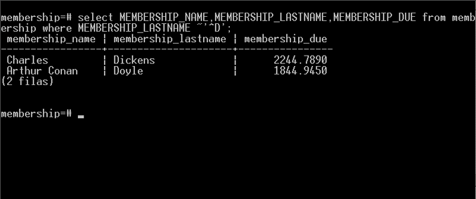

# Regular Expressions (expresiones regulares) en PostgreSQL

Cuando las búsquedas con el operador <b>Like</b> no son lo suficientemente flexibles para localizar los registros que necesitamos, PostgreSQL permite las búsquedas de registos mediante el uso de regular expressions (expresiones regulares).

En este par de posts: Regular Expressions en PL/SQL Oracle, parte I y parte II  coloque unos ejemplos de la utilización de expresiones regulares en Oracle.

Ahora utilizaré los mismos ejercicios de esas entradas, pero ahora para mostrar las regular expressions en PostgreSQL.

Creamos una tabla llamada <i>membership</i>:

Ahora insertamos algunos registros con el script:

<b>El operador ~</b>

Como primer ejemplo utilizamos el operador <b>~</b> (LIKE versión regular expression) en la consulta para buscar en la columna MEMBERSHIP_LASTNAME aquellos registros que empiecen con la letra
<i>D.</i>

Aquí un segundo ejemplo en donde buscamos en la columna MEMBERSHIP_LASTNAME aquellos registros que comiencen con las letras de la <i>A</i> a la <i>F</i>.

<b>El operador inverso !</b>

Ahora mostraré los ejemplos anteriores utilizando el operador inverso <b>!</b> o la negación del operador <b>~</b> para el primer ejemplo, esta consulta busca en la columna MEMBERSHIP_LASTNAME aquellos registros que no empiecen con la letra <i>D</i>.

El mismo operador de negación para el segundo ejemplo, esta consulta busca en la columna MEMBERSHIP_LASTNAME aquellos registros que no empiecen con las letras de la <i>A</i> a la <i>F</i>.

<b>El operador case-insensitive *</b>

Tanto <b>~</b> como <b>!</b> son case-sensitive, si necesitas que ambos operadores sean 
case-insensitive se combinan con el operador <b>*</b> , como en el ejemplo siguiente donde buscamos en la columna MEMBERSHIP_LASTNAME aquellos registros que después del primer caracter tenga la letra <i>O</i> mayúscula repetida una o más veces.

Esta búsqueda no dio resultados porque excepto la primera letra de los registros en la columna MEMBERSHIP_LASTNAME el resto se encuentran en letras minúsculas, entonces para que la consulta encuentre resultados utilizamos el operador <b>*</b>.

Ahora si la consulta anterior mostro los resultados.

